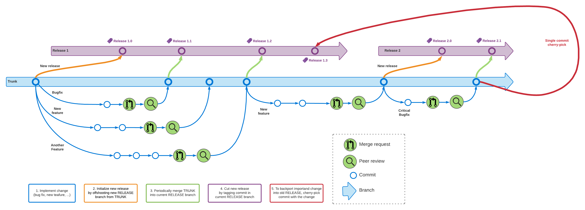

# Revolgy Development Manifesto

## About

TODO general description, we the people

TODO mention that content in quotes is optional reading

TODO mention that everything should be done diligently and responsibly.

### Technologies

We primarily use the following technologies:

- [Git]
- [Terraform]

**Git** is currently the unofficial standard [Version Control System][VCS]. [Git can be installed on almost any platform][Installing Git] and is supported by most development environments natively.

> Even though most Git repositories seem centralized, for example on [GitHub], Git itself is a distributed VCS.
> There is no major difference between the repository you might have on your PC, and the repository on your platform of choice—you could _technically_ host the repository on your PC for public viewing.
> Some more traditional workflows, such as the one of the creator of [Linux] (and also Git itself), [Linus Torvalds], use Git in such a fashion that Linus' own repository is considered to be the main repository of the kernel where he accepts incoming changes via email and only when he pushes it to [torvalds/linux.git] is it considered an officially accepted change of the "mainline" kernel. Other Kernel developers and maintainers have their own Linux repositories. [stable/linux.git] hosts the "stable" kernel. While it is technically a different repository, it has mostly the same commits with mostly the same history as the "mainline" kernel, and so you might have linux.git locally with both the "mainline" and the "stable" repositories as remotes.

**Terraform** is a [Infrastructure-as-Code][IaC] tool.

> Terraform is really a relatively simple tool which through its providers is capable of provisioning infrastructure on almost any cloud platform with an API.
> On each run of Terraform, it checks the entirety of the current state and code base, which only gets slower with each new resource, and Terraform doesn't have a built-in solution to this problem, other than that there is a simple recommendation to keep its code bases small and in stages.
> Terraform must be able to resolve the dependency graph as it's written in code, otherwise it won't run.

### Strategies

At Revolgy, we have elected to use the following procedures, processes, or strategies.

- [Trunk Based Development]
	- ... is a branching strategy for Git.
- [Code Review]
	- ... is the idea that all code that gets released is looked at by more than 1 person.
- [CI/CD]
	- ... is the process that automatically runs tests and builds the software—or in our case, the infrastructure.
	- **Note**: This guide assumes that the environment is set so that **EVERY CHANGE IS TESTED** before ultimately being used. 

## Trunk Based Development (Git)

### Definitions

This section requires that the reader know the basic usage of **Git**.

- **commit**: in Git, a commit is a collection of files in a tree, and the commit usually has a preceding commit.
- **branch**: in Git, a branch is a name for a specific commit and therefore its history as well. Branches can be updated by **push**ing, and pushing cannot change history—unless with `--force` on branches that aren't protected.
- **protected branch**: on most Git platforms, a protected branch is a branch that cannot be pushed to directly, or at least not by non-owners, and has to be merged to, usually with Code Review.
- **rebase**: in Git, a rebase is the act of taking a branch that split off from its parent branch at some point in the past, and re-committing on top of a different (usually newer) commit.
- **merge**: in Git, a merge is the act of joining two branches together. There are several strategies that Git can use based on the circumstances.
	- **fast-forward**: a fast-forward merge requires that the branch that is getting merged be based on top of the branch that its getting merged into. The fact that the off-branch is in such a position means that any merge conflicts (or rebase conflicts) have already been resolved. Then, it can simply be updated with all those new commits.
	- **merge commit**: a merge commit is a special type of commit that has two parent commits, effectively joining them. The use of a merge commit may sometimes lead to there being a merge conflict, which has to be resolved manually.
- **merge request**: (or **pull request**) on most Git platforms, a merge request is a form of keeping track of changes that are proposed to be merged into a different branch, usually the main protected branch. Usually, it can be set so that only the "maintainer" or "owner" of the repository can accept the MR, and this person can also directly request that changes be made to the MR before acceptance through discussion.

### Abstract

`trunk` is the main branch of the repository. It is protected and _shouldn't_ be pushed into directly under normal circumstances.

Every change is being developed in its own temporary branch created off `trunk`.

Changes are to be accepted only after CI and Code Review, and new test coverage must be part of the Merge Request if applicable.

`trunk` is an active rolling branch with the latest code which can (and should) be continuously deployed into a **testing** environment.

To cut a new release, a `release` branch is created and the release commit is **tag**ged with a version number. Stick to [Semantic Versioning].

Tagged releases can be then deployed by a CD pipeline.

`trunk` branch is periodically merged into the current `release` and when a new version of the current release should be issued, appropriate commit is being tagged with new version number.

If we run into a situation when we need to back-port something into an older release branch which is not in sync with `trunk` anymore, we `cherry-pick` a single commit from the `trunk` and tag a new version of this older release.

### Applied Trunk Based Development

#### Committing



When creating a repository, always set `trunk` as the default branch (in place of what otherwise would be `main` or historically `master`) and on your Git platform of choice, set the `trunk` branch to be protected so that not just anyone can push to it.

Clone the repository locally:

```sh
git clone "git@example.org:acme/tbd.git"
```

**ENSURE YOU HAVE THE TRUNK UPSTREAM SET**:

```sh
git branch -u origin/trunk trunk
```

When making changes and starting a new branch for them, make sure that your local `trunk` is in sync with the remote. Other people can make changes to the repository, and you would waste time by having to re-base your work afterwards.

```sh
# Fetch changes on the remotes.
git fetch
# Examine changes.
git log --all --graph --oneline

# Ensure you have the trunk branch checked out.
git switch trunk

# If you had some work (accidentally) committed to trunk that isn't on the
# remote, consider making a branch for it.
git switch -c branchname
# Or if you have some changes that aren't even committed yet, you may either
# commit them...
git commit -m 'Description of commit up to 80 chars'
# ... or stash them locally.
git stash

# If there weren't any history disruptions, you may simply run the following
# command. This will set your local trunk to origin/trunk.
git pull --ff-only

# If you had committed some work that you would like to abandon, you could
# always reset.
git reset --hard origin/trunk
```

You can theoretically also do all of that with just this command, however you will still have to handle the possible case of not having pushed your local changes.

```sh
git pull --rebase
```

Now, create your off-shoot branch.

```sh
git switch -c feature/foo
```

If you would like to skip synchronizing your local `trunk` with `origin`, you can also create the branch directly off it, but it is recommended to keep things in sync.

```sh
git switch -c feature/foo origin/trunk
```

Now, make your changes and commit them as you normally would.

```sh
git add ...
git commit -m '...'
```

If you have made several commits and would like to squash them or edit their commit messages, you can run the following command. This will open an editor (probably `nano`) where there will be instructions on what you can do with it.

```sh
git rebase -i COMMIT_SHA
# The -i stands for interactive.
# The COMMIT_SHA can be found by running git log --all --graph --oneline
# and finding the commit SHA where your branch split off, like 5f271293.
# You can also use a branch name in place of the SHA, but there will be cases
# where that commit no longer has a branch name on it.
```

If in the meantime someone made changes, fetch and re-base.

```sh
git fetch
# inspect changes
git rebase origin/trunk
```

And finally push.

```sh
git push origin feature/foo
```

#### Creating a Merge Request

Whenever you push to GitLab or any other Git platform, the output of the `push` command should show something like the following

```
remote:
remote: To create a merge request for feature/non-prod-env, visit:
remote:   [https://gitlab.com/Revolgy/branching-playground/-/merge_requests/new?merge_request[source_branch]=feature%2Fnon-prod-env](https://gitlab.com/Revolgy/branching-playground/-/merge_requests/new?merge_request%5Bsource_branch%5D=feature%2Fnon-prod-env)
remote:
```

Clicking on the link should take you to the MR creation form with the important fields (source branch, target branch) already filled in.

Assign reviewers (i.e. people other than yourself) and wait for them to go over your changes and hopefully sign off on them.

Finally, when the changes have been approved and the CI pipeline has finished successfully, the Merge Request is ready.

Click the "Merge" button and the Git platform will automatically add your changes to the target branch—`trunk`.

Ideally, if there is the option to do it, make the platform also delete its version of your branch. If the option isn't there or if you simply want to do it yourself for whatever reason, run the following command:

```sh
git push --delete origin feature/foo
```

You may also want to delete your local version of it too.

```sh
# If the changes have been merged and are currently in sync.
git branch -d feature/foo

# If the changes are already out of sync but you're sure you won't lose any
# data, you may force-delete the branch.
git branch -D feature/foo
```

#### Releasing

When a major version of a product is out, it is needed to cut the new release branch which will track the life of this major version until next release will come.

Each release should be branched off the current `trunk`. So first of all make sure that you have checked out the `trunk` branch and it is up to date with the upstream:

```sh
git switch trunk
git pull --rebase
```

Now create the new release branch and push it into upstream:

```sh
git switch -c release/1
git push -u origin release/1
```

Also you can tag the very first version of the new release. **This will be a repeated action for every new released version.**

```sh
git tag release-1.0
git push --tags
```

The current `release` branch should go along with the `trunk`. So `trunk` should be periodically merged into the current `release`.

```sh
git switch trunk
git pull --rebase
git switch release/1
git merge trunk
```

## Code review (Git, GitLab, GitHub)

### Definitions

TODO explain PR/MR based on platform

### Abstract

TODO short version of code review

### Applied code review

TODO practical examples, templates

## Terraform structuring and best practices (Git, Terraform)

### Project structure options

TODO table of "projects", "modules"...

TODO gitignore

### Remote state

TODO best practices for remote state

### Writing modules

TODO standard structure of modules based on official recommendation

TODO methodology for what inputs and outputs there should be

TODO write description everywhere in outputs and inputs

### Using modules

TODO using local modules

TODO using remote modules

### CI/CD

TODO basic stuff

### Optimization for CI/CD performance

TODO stages with CI/CD not running that part of terraform to save time

[Git]: https://git-scm.com/
[Trunk Based Development]: https://trunkbaseddevelopment.com/
[Terraform]: https://www.terraform.io/
[IaC]: https://en.wikipedia.org/wiki/Infrastructure_as_code
[CI/CD]: https://about.gitlab.com/topics/ci-cd/
[Code Review]: https://about.gitlab.com/topics/version-control/what-is-code-review/
[VCS]: https://git-scm.com/book/en/v2/Getting-Started-About-Version-Control
[Installing Git]: https://git-scm.com/book/en/v2/Getting-Started-Installing-Git
[GitHub]: https://github.com/
[Linus Torvalds]: https://en.wikipedia.org/wiki/Linus_Torvalds
[torvalds/linux.git]: https://git.kernel.org/pub/scm/linux/kernel/git/torvalds/linux.git
[stable/linux.git]: https://git.kernel.org/pub/scm/linux/kernel/git/stable/linux.git
[Linux]: https://kernel.org/
[Semantic Versioning]: https://semver.org/